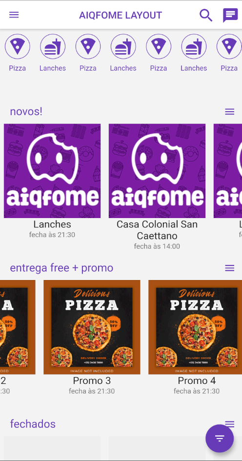
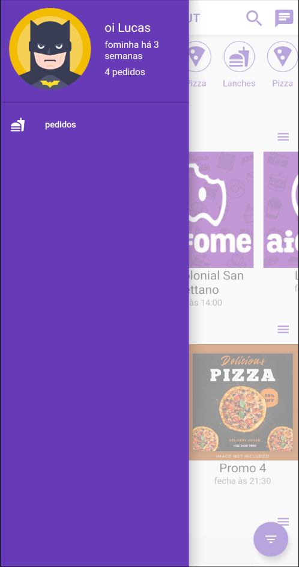

# aiqfome layout - Flutter Application

    
    

## About this project

The idea of this app is : Remake a famous app layout.

## Why ?

This project is part of my personal portfolio, it was made to increase my development skills.

